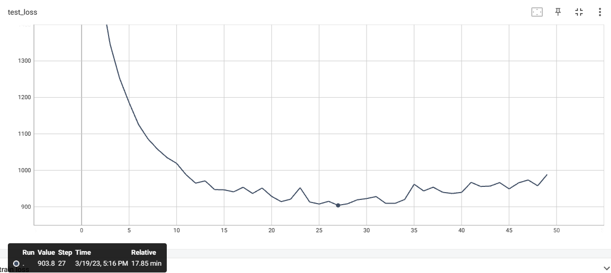

### Introduction
---

本项目选择TextCNN模型对文本进行分类，一共分成十个类别，是通过train_data.txt对文本分类模型进行训练，查看每个模型对应的损失以及准确率自行选择用于预测的模型参数，最后对test.txt进行预测按照submit_example.txt的格式进行保存预测结果

项目使用的训练数据集格式示例如下：

{"label": 0, "raw": "train sentences"}


### Requirements

---

```
torch                        1.13.1
gensim                       4.2.0
```


### Results

---

| Best Accuracy Result |
| -------------------- |
| 0.8087               |





### Usage

---

```
python main.py -h
```

得到

```
usage: main.py [-h] [-lr LR] [-epoch EPOCH] [-kernel_nums KERNEL_NUMS]
               [-divident DIVIDENT] [-padding_size PADDING_SIZE]
               [-test_data_path TEST_DATA_PATH] [-word2vec_size WORD2VEC_SIZE]
               [-dropout DROPOUT]

CNN model training

optional arguments:
  -h, --help            show this help message and exit
  -lr LR                learning_rate
  -epoch EPOCH          training eochs
  -kernel_nums KERNEL_NUMS
                        number of each kind of kernel
  -divident DIVIDENT    ratio of the training set to the test set
  -padding_size PADDING_SIZE
                        number of words picked in each sentence
  -test_data_path TEST_DATA_PATH
                        address of data used to train
  -word2vec_size WORD2VEC_SIZE
                        word2vec dim
  -dropout DROPOUT      dropout
```


### Train

---

首先需要提前创建一个models文件夹，用来存储项目中使用的word2vec模型参数以及训练中产生的CNN模型参数

```
python main.py
tensorboard --logdir='train_log'
```

能够得到如上所示的两张图片，可以根据上面显示的准确率和准确率选择训练好的CNN文本分类模型参数的序号


### Predict

---

```
python pridict.py
#需要输入上面选择的序号
#输出按照submit_example.txt的格式存储在主目录下的submit.txt中
```

```
id, pred
0, 0
1, 1
2, 4
3, 1
4, 6
5, 7
6, 5
7, 4
8, 9
9, 7
10, 6
```

